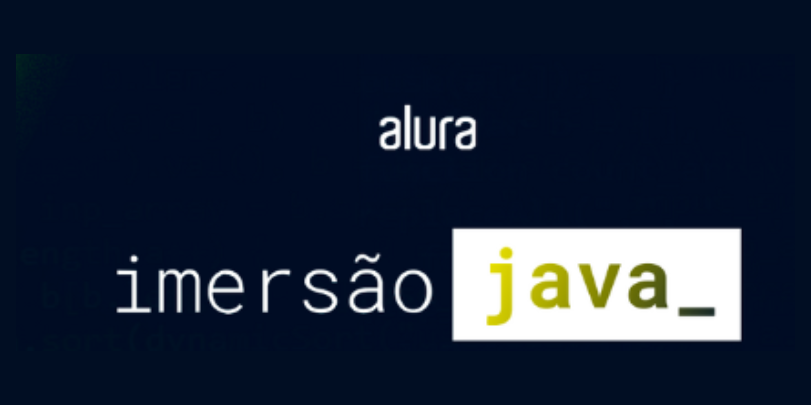

<h1 align="center">
    
</h1>

<h4 align="center">
    Alura Java Week ☕🚀
</h4>

 

## 💻☕ Instrutores e instruturas da Alura nessa imersão:

- Jacqueline Olivera;
- Alexandre Aquiles;
- Paulo Oliveira.

 

## 💻☕ Sobre a semana 

☕🤔 A semana de imersão em Java tem como principal objetivo aprofundar os conhecimentos essenciais na linguagem.  
☕🤔 Desta forma durante os sete dias de conteúdos e conhecimentos compartilhados, os assuntos serão:
 
- Consumo de api de filmes;
- Gerando stickers para whatsapp;
- Orientação a objetos;
- Criando a própria API com Spring;
- Publicação da API no Cloud.

 

## 💻☕ Alguns links:
* [Api de Filmes🎥](https://raw.githubusercontent.com/alura-cursos/imersao-java-2-api/main/TopMovies.json)
* [Expressões Regulares](https://regex101.com/)
* [Decorar o Terminal👨‍💻](https://www.alura.com.br/artigos/decorando-terminal-cores-emojis)
* [Guia do Mergulho🤿](https://grupoalura.notion.site/Imers-o-Java-2-Edi-o-Guia-do-Mergulho-69e40005601f4d089a9add98251197de)
* [Repositório Imersão Java 2](https://github.com/alura-cursos/imersao-java-2/tree/aula1)
* [Documentação do pacote javax.imageio - trata de leitura e escrita de imagens](https://docs.oracle.com/en/java/javase/17/docs/api/java.desktop/javax/imageio/package-summary.html)
* [Documentação da classe BufferedImage - Representa uma imagem no Java](https://docs.oracle.com/en/java/javase/17/docs/api/java.desktop/java/awt/image/BufferedImage.html)
* [Documentação da classe Graphics2D - permite escrever, desenha e imprimir outras imagens em uma imagem original](https://docs.oracle.com/en/java/javase/17/docs/api/java.desktop/java/awt/Graphics2D.html)
* [Documentação da abstração InputStream - representa um fluxo de leitura de dados de qualquer fonte, como arquivos, URLs, etc](https://docs.oracle.com/en/java/javase/17/docs/api/java.base/java/io/InputStream.html)

 
 
<h4 align="center"> 
    🚧 Projeto em construção 🚧
     
    27/03/2023 até 31/03/2023
</h4>